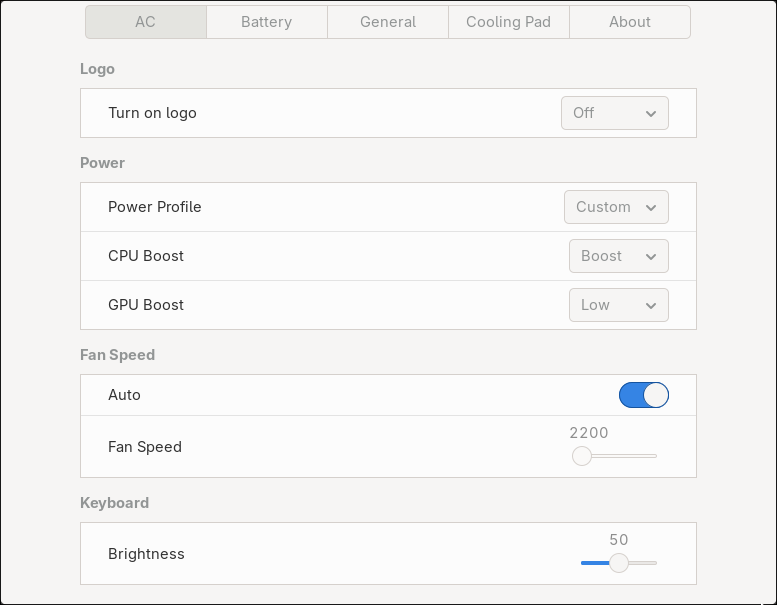

# Razer Laptop Control

This is an experimental application designed to control certain features
available on Razer laptops. It is not officially supported by Razer, nor does
it have dedicated maintainers for each device. Use it at your own risk.

Support for devices is community-driven. Each supported model has been at least
partially tested by the contributor who added it, but functionality may be
incomplete or vary between devices.



## Features:

- Light control (you can opt out if you are using OpenRazer)
- Battery charging limits
- Power profiles
- Fan control
- Logo control
- Basic GUI
- CLI

## Supported Init Systems

In order to run as a service this application runs as a `systemd` daemon. There
is also code to run in `openrc`, but it is currently unmaintained.

## Supported Installation Methods

We currently support installing the application via installation script and via
NixOS Flake. The flake has no known maintainers but we try to keep it working.

### Installing via script

Before installing, the following dependencies are needed:

- Rust available on your terminal
- The following packages or their equivalent:
    - `libdbus-1-dev libusb-dev libhidapi-dev libhidapi-hidraw0 pkg-config libudev-dev libgtk-3-dev`

With those installed, run `./install.sh install` as a normal user. Then reboot.

### Installing via Nixos Flake

1. Add this flake to your inputs using

```
inputs.razerdaemon.url = "github:JosuGZ/razer-laptop-control";
```

2. Import the razerdaemon module where your inputs are in scope

```
imports = [
    inputs.razerdaemon.nixosModules.default
];
```

3. Enable the exposed nixos option using

```
services.razer-laptop-control.enable = true;
```

## Troubleshooting

When having problems with the application, please share the following
information:

- Journal: `journalctl --user-unit razercontrol > razercontrol.journal.log`
- Output from `razer-cli device-info`
- Output from `systemctl --user status razercontrol`

## Unofficial Razer Linux Channel

You can find support on the following discord server, under the
'razer-laptop-control' channel: [Discord link](https://discord.gg/GdHKf45).
